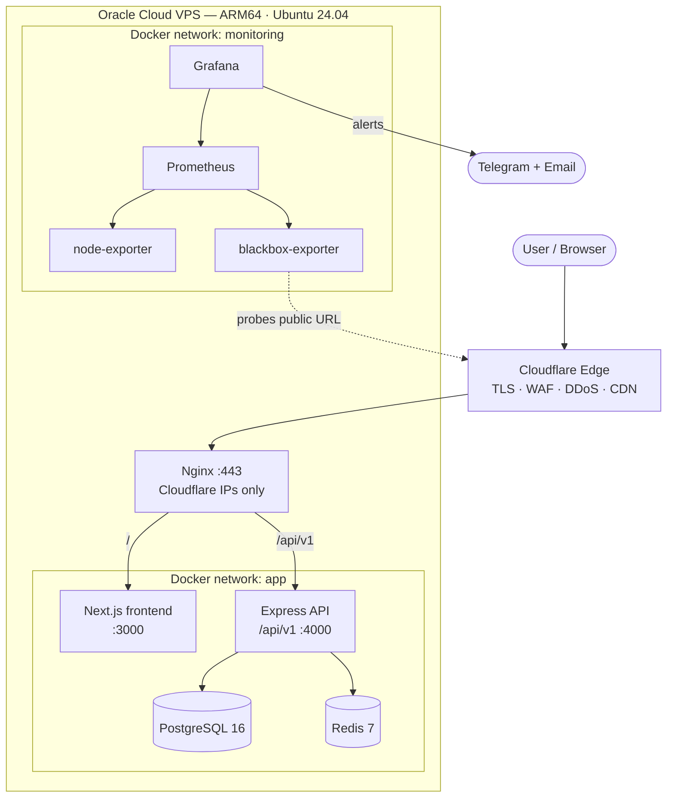
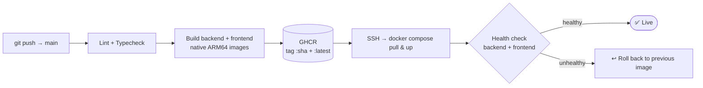

<div align="center">

# 🐫 Ghumo Firo Holidays

### Full-stack tour-booking platform for exploring Rajasthan — production-grade, containerized, observable.

[](https://ghumofiroindia.com)
[](https://github.com/devxkamlesh/ghumophiroindia/actions/workflows/deploy.yml)
[](./LICENSE)

[](https://nextjs.org/)
[](https://react.dev/)
[](https://www.typescriptlang.org/)
[](https://nodejs.org/)
[](https://expressjs.com/)
[](https://www.postgresql.org/)
[](https://redis.io/)
[](https://www.docker.com/)
[](https://www.cloudflare.com/)
[](https://tailwindcss.com/)

[**🌐 Live Site**](https://ghumofiroindia.com) · [**🐛 Report a Bug**](https://github.com/devxkamlesh/ghumophiroindia/issues) · [**✨ Request a Feature**](https://github.com/devxkamlesh/ghumophiroindia/issues)

</div>

---

## � Table of Contents

- [Overview](#-overview)
- [Highlights](#-highlights)
- [Features](#-features)
- [Tech Stack](#-tech-stack)
- [Architecture](#-architecture)
- [Performance](#-performance--load-testing)
- [Security](#-security)
- [CI/CD & DevOps](#-cicd--devops)
- [Observability](#-observability)
- [Project Structure](#-project-structure)
- [Getting Started](#-getting-started)
- [Environment Variables](#-environment-variables)
- [API Overview](#-api-overview)
- [Scripts](#-scripts)
- [Roadmap](#-roadmap)
- [Contributing](#-contributing)
- [License](#-license)
- [Author](#-author)

---

## 🧭 Overview

**Ghumo Firo Holidays** is a modern travel platform for discovering and booking curated tours across
Rajasthan — the Golden Triangle, heritage city tours, and desert safaris from Jaipur. It pairs a
polished, SEO-optimized **Next.js** storefront with a secure **Express** REST API, and runs as a
fully containerized stack behind Cloudflare on a single ARM64 VPS — with push-to-deploy CI/CD,
automated rollback, and end-to-end monitoring.

> This repository is both a **real product** and a **reference example** of taking a live app from a
> single process to a self-healing, observable, security-hardened deployment.

| | |
|---|---|
| 🌍 **Live** | [ghumofiroindia.com](https://ghumofiroindia.com) |
| 🧱 **Type** | Monorepo (npm workspaces: `backend`, `frontend`) |
| ☁️ **Edge** | Cloudflare (TLS · WAF · DDoS · CDN) |
| 🖥️ **Host** | Oracle Cloud VPS — ARM64 (Ampere), Ubuntu 24.04, 4 vCPU / 24 GB |
| 🚢 **Runtime** | Docker Compose (app + monitoring on isolated networks) |

---

## ✨ Highlights

- ⚡ **~19 ms mean latency** serving 13,000+ requests at 100 concurrent users (through Cloudflare)
- 🔁 **Push-to-deploy CI/CD** — build ARM64 images → GHCR → SSH deploy → health check → **auto-rollback**
- 📊 **Full observability** — Prometheus + Grafana + blackbox probes, 15-day history, Telegram + email alerts
- 🔒 **Security-hardened** — origin locked to Cloudflare IPs, JWT/RBAC, per-user rate limiting, strict headers
- �️ **Hierarchical destinations** — tours aggregate across a location's whole subtree (state → city → place)
- 🧩 **Redis caching + event-driven invalidation** for hot read paths
- 🧪 **Zero-data-loss migration** from PM2 → Docker on a live production site

---

## 🎯 Features

### For Travelers
| Feature | Description |
|---------|-------------|
| 🔎 Browse & filter | Tours by category, price, duration, and search — server-side, paginated |
| 🗺️ Destinations | Explore by state → city → place; each destination aggregates all its tours |
| 📄 Rich tour pages | Day-by-day itinerary, inclusions/exclusions, gallery, map, policies |
| 🧾 Online booking | Multi-traveler booking with validation and instant email confirmation |
| ✍️ Custom tours | Request a tailor-made itinerary; inquiry & contact forms |
| 📱 Responsive | Mobile-first UI, accessible, fast (optimized images, ISR) |

### For Admins
| Feature | Description |
|---------|-------------|
| 🧳 Tours | Full CRUD with an AI-assisted "fill from JSON" import helper |
| 📅 Bookings | Manage, filter, and track booking + payment status |
| 📥 Inquiries | Handle customer inquiries and custom-tour requests |
| 🖼️ Content | Banners, place cards, gallery, and location tree management |
| 👤 Access control | Role-based (`user` / `admin` / `superadmin`) with JWT + refresh tokens |

---

## 🛠 Tech Stack

| Layer | Technologies |
|-------|--------------|
| **Frontend** | Next.js 16 (App Router, SSR/ISR), React 19, TypeScript, Tailwind CSS, Radix UI, SWR, Zustand, Framer Motion, MapLibre GL |
| **Backend** | Node.js, Express, TypeScript, Drizzle ORM, Zod, JWT (jose), Helmet, express-rate-limit |
| **Data** | PostgreSQL 16, Redis 7 (cache + distributed rate-limit store) |
| **Edge / Infra** | Cloudflare, Nginx, Docker & Docker Compose, Oracle Cloud (ARM64 / Ampere) |
| **CI/CD** | GitHub Actions, GitHub Container Registry (GHCR), immutable SHA-tagged images |
| **Observability** | Prometheus, Grafana, node-exporter, blackbox-exporter, Telegram + Resend (email) |
| **Integrations** | Cloudinary (images), Resend (transactional email), Google Analytics 4 |

---

## 🏗 Architecture

Every request flows `Browser → Cloudflare → host Nginx → container`. Nginx is the only public
ingress and accepts traffic **only from Cloudflare IP ranges**. App containers talk to Postgres and
Redis by Docker DNS name on a private network; the monitoring stack lives on a separate network and
probes the **public URL** so it verifies the entire real path.



> 📚 A deeper write-up (user flows, data flow, and the PM2 → Docker migration) lives in
> [`docs/ARCHITECTURE.md`](./docs/ARCHITECTURE.md).

---

## 📈 Performance & Load Testing

Load tested with **k6** from a dedicated generator in Mumbai, driving traffic **through Cloudflare**
to reflect real user experience.

| Concurrent users | Requests | Mean latency | p95 latency | Error rate |
|:---:|:---:|:---:|:---:|:---:|
| **100** | 13,139 | **~19 ms** | 48 ms | **0%** |
| **1,000** | 76,179 | 2.36 s | 4.8 s | ~0% |
| **2,000** | 93,103 | 5.3 s | 20.5 s | 14% |

- **Flat scaling** to a few hundred users — a 20× load increase moved p95 by only ~9 ms.
- **Graceful degradation** to ~1,000 concurrent (higher latency, still ~0 errors).
- **Reliable ceiling ≈ 1,000 concurrent users** on a single, uncached-SSR VPS; hard wall ≈ 2,000.

---

## 🔒 Security

| Control | Status |
|---------|:---:|
| Origin firewalled to Cloudflare IP ranges (direct-IP access blocked) | ✅ |
| JWT auth with rotating refresh tokens + token-version revocation | ✅ |
| Role-based access control (RBAC) + ownership checks (no IDOR/BOLA) | ✅ |
| Parameterized queries via Drizzle (SQL-injection safe) | ✅ |
| Per-user API rate limiting (Redis-backed, distributed) | ✅ |
| Full security-header suite (HSTS, CSP, X-Frame-Options, etc.) | ✅ |
| Mass-assignment protection on registration | ✅ |
| Secrets in gitignored `.env` on the server, injected at runtime | ✅ |

> Verified via an authorized, non-destructive assessment (nuclei, sqlmap, JWT/authz testing).

---

## 🚀 CI/CD & DevOps

Push to `main` triggers verification, native **ARM64** image builds, a registry push, and a
zero-touch deploy with an automatic rollback if the post-deploy health check fails.



- Images are **immutable and SHA-tagged**, so rollback is deterministic.
- Builds run in CI (not on the small VPS) — deploys drop from minutes to seconds.
- Path-filtered triggers skip app redeploys for docs/monitoring-only changes.

---

## 📊 Observability

| Component | Role |
|-----------|------|
| **Prometheus** | Scrapes metrics; 15-day retention |
| **Grafana** | Dashboards + alerting (provisioned as code) |
| **node-exporter** | Host CPU / memory / network metrics |
| **blackbox-exporter** | HTTP up/down probes of the live public URL |
| **Alerts** | 5 rules → Telegram + email (both fire); re-notify every 1 min; NoData → OK |

---

## 📁 Project Structure

```
ghumophiroindia/
├── backend/                     # Express REST API (/api/v1)
│   └── src/
│       ├── core/                # config, database (Drizzle), redis, logger, events
│       ├── modules/             # auth, tours, bookings, inquiries, locations, banners…
│       ├── middleware/          # auth, validation, rate limiting, error handling
│       └── shared/              # jwt, password, email, errors, response helpers
├── frontend/                    # Next.js 16 app (App Router)
│   └── src/
│       ├── app/                 # routes: (public) / (auth) / (dashboard) / (user-panel)
│       ├── components/          # public + dashboard UI
│       ├── services/            # typed API client
│       └── lib/ hooks/ types/   # utilities, hooks, shared types
├── infrastructure/
│   ├── docker/                  # Dockerfiles + docker-compose.production.yml
│   └── monitoring/              # Prometheus + Grafana + exporters (compose)
├── .github/workflows/           # CI (lint/typecheck) + CD (build/push/deploy)
└── docs/                        # architecture & guides
```

---

## 🏁 Getting Started

### Prerequisites
- **Node.js** 20+ (22 recommended) and **npm** 9+
- **PostgreSQL** 16 and **Redis** 7 (Redis optional in dev — cache/limits degrade gracefully)

### 1. Clone & install
```bash
git clone https://github.com/devxkamlesh/ghumophiroindia.git
cd ghumophiroindia
npm install        # installs all workspaces
```

### 2. Backend
```bash
cd backend
cp .env.example .env          # fill in DATABASE_URL, JWT secrets, etc.
npm run db:push               # apply schema to your database
npm run db:seed               # optional: seed sample tours
npm run dev                   # http://localhost:4000
```

### 3. Frontend
```bash
cd frontend
cp .env.example .env.local     # set NEXT_PUBLIC_API_URL
npm run dev                    # http://localhost:3000
```

### 4. Or run the full stack with Docker
```bash
# from infrastructure/docker (expects a local .env — see .env.docker.example)
docker compose -f docker-compose.production.yml up -d
```

---

## 🔐 Environment Variables

**Backend** (`backend/.env`) — key values:

| Variable | Description |
|----------|-------------|
| `DATABASE_URL` | PostgreSQL connection string |
| `JWT_SECRET` / `JWT_REFRESH_SECRET` | Access & refresh signing secrets (must differ) |
| `REDIS_HOST` / `REDIS_PORT` | Local Redis (or `UPSTASH_REDIS_REST_URL` + `_TOKEN`) |
| `CORS_ORIGIN` | Comma-separated allowed origins |
| `RESEND_API_KEY` / `EMAIL_FROM` | Transactional email (Resend) |
| `CLOUDINARY_*` | Image uploads |
| `RATE_LIMIT_*` | Window + per-user / anon-read / write budgets |

**Frontend** (`frontend/.env.local`) — inlined at build time:

| Variable | Description |
|----------|-------------|
| `NEXT_PUBLIC_API_URL` | API base, e.g. `http://localhost:4000/api/v1` |
| `NEXT_PUBLIC_APP_URL` | Public site URL |
| `NEXT_PUBLIC_GA_ID` | Google Analytics 4 measurement ID (optional) |

---

## 🔌 API Overview

Base path: `/api/v1` · JSON envelope: `{ success, data, message }` · auth via httpOnly cookies.

| Method | Endpoint | Description | Auth |
|--------|----------|-------------|:---:|
| `GET` | `/health` | Liveness + dependency status | – |
| `POST` | `/auth/register` · `/auth/login` | Account + session (sets cookies) | – |
| `POST` | `/auth/refresh` · `/auth/logout` | Rotate / revoke session | 🍪 |
| `GET` | `/tours` | List tours (filter, sort, paginate) | – |
| `GET` | `/tours/:id` · `/tours/slug/:slug` | Tour detail | – |
| `GET` | `/tours/featured` · `/tours/categories` | Home data | – |
| `GET` | `/locations` · `/locations/:id/tours` | Destinations (subtree-aware) | – |
| `POST` | `/bookings` | Create a booking | optional |
| `POST` | `/inquiries` · `/custom-tours` | Leads | – |
| `*` | `/tours` · `/bookings` · `/admin/*` (write) | Management | 🔒 admin |

> Full reference: [`backend/API.md`](./backend/API.md).

---

## 📜 Scripts

| Location | Command | Purpose |
|----------|---------|---------|
| root | `npm install` | Install all workspaces |
| backend | `npm run dev` / `build` / `start` | Run / compile / serve API |
| backend | `npm run db:push` / `db:seed` / `db:studio` | Schema, seed, Drizzle Studio |
| backend | `npm run lint` / `typecheck` | Quality gates |
| frontend | `npm run dev` / `build` / `start` | Run / build / serve app |
| frontend | `npm run lint` / `typecheck` | Quality gates |

---

## 🗺 Roadmap

- [x] Containerize (PM2 → Docker) with zero data loss
- [x] Push-to-deploy CI/CD with auto-rollback
- [x] Prometheus/Grafana observability + multi-channel alerts
- [x] Origin lockdown to Cloudflare + security hardening
- [x] Per-user rate limiting & Redis caching
- [x] GA4 analytics
- [ ] Cloudflare caching for homepage + static assets (capacity multiplier)
- [ ] Online payments
- [ ] Reviews & ratings surfaced on tour pages
- [ ] i18n (English / Hindi)

---

## 🤝 Contributing

Contributions are welcome!

1. Fork the repo and create a branch: `git checkout -b feat/your-feature`
2. Make changes; ensure `npm run lint` and `npm run typecheck` pass in both workspaces
3. Commit using clear, conventional messages (e.g. `feat(tours): …`)
4. Open a Pull Request describing the change and how you tested it

---

## 📄 License

Distributed under the **MIT License**. See [`LICENSE`](./LICENSE) for details.

---

## 👤 Author

**Kamlesh Choudhary** — Full-stack & AI engineer

[](https://github.com/devxkamlesh)

> _Code. Build. Ship._

<div align="center">

⭐ If this project helped or inspired you, consider giving it a star!

</div>
